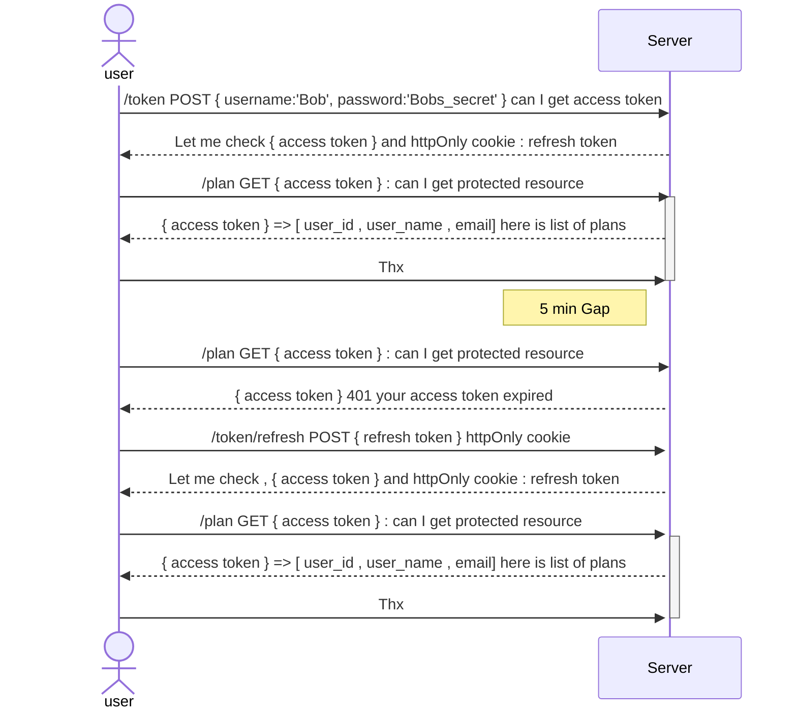
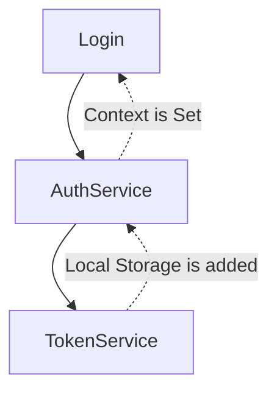

1. To set httpOnly cookie make sure the following
   - At `settings.py` </br>
        `CORS_ALLOW_CREDENTIALS = True`
   - While making request from axios make sure it has `withCredentials`
```js
    const authAxios = axios.create({
        baseURL: "http://localhost:8000",
        withCredentials: true,
        headers: {}
    });
```



Login flow:



Login.tsx -->  auth.service.ts --> token.service.ts (localStorage is added)
