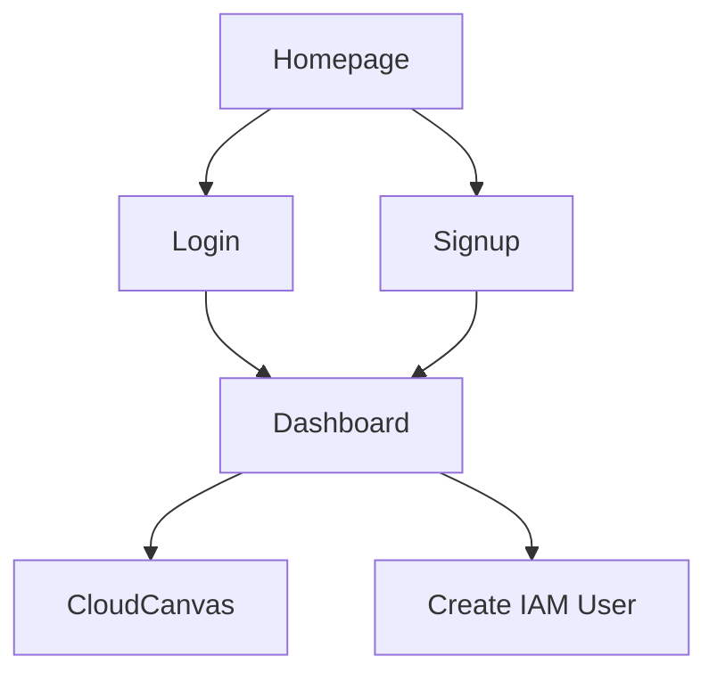

### User to deploy an EC2 instance
- cloud_type : aws
- iam policy (cx supplied)  
- aws iam user (this user uses above policy)
  - AWS_ACCESS_KEY_ID="PLACEHOLDER"
  - AWS_SECRET_ACCESS_KEY="PLACEHOLDER"
- [ AWS Account]  
- security_group : `hisSecurityGroup`
- subnetId : `hisSubnet`
- region_name=`us-west-1`
- EC2 instance
  - ImageId=`ami-0f5e8a042c8bfcd5e`
- Instance type (eg: t2.micro)
  - RAM
  - vCPU

### Create IAM user and attach this policy:
iam policy 

```json
{
    "Version": "2012-10-17",
    "Statement": [
        {
            "Effect": "Allow",
            "Action": [
                "ec2:RunInstances",
                "ec2:TerminateInstances",
                "ec2:StartInstances",
                "ec2:StopInstances"
            ],
            "Resource": "*"
        },
        {
            "Effect": "Allow",
            "Action": [
                "ec2:CreateTags",
                "ec2:DescribeInstances",
                "ec2:DescribeInstanceStatus",
                "ec2:DescribeAddresses",
                "ec2:AssociateAddress",
                "ec2:DisassociateAddress",
                "ec2:DescribeRegions",
                "ec2:DescribeAvailabilityZones"
            ],
            "Resource": "*"
        }
    ]
}
```

#### Refrence 
The Subnet and Security Group should be in the default VPC, if you do not want to create a new VPC
This is the response for the above code
`
(cloudskin) iniyan@iniyans-MacBook-Pro 2-boto3 % aws ec2 describe-instances --region us-west-1 --query 'Reservations[].Instances[].[InstanceId,Tags[]]' --output text --filters Name=instance-state-name,Values=running
i-09f110d1dccb60681     None
`


Used this resource: https://blog.knoldus.com/how-to-create-ec2-instance-using-python3-with-boto3/
ARN for created user: arn:aws:iam::334431854769:user/resource-manager

