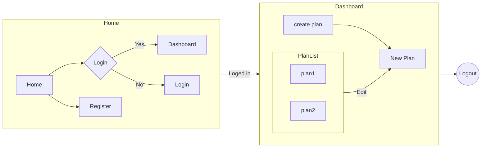

```mermaid
flowchart LR
  subgraph Dashboard
    direction LR
    subgraph PlanList
      direction LR
      plan1
      plan2
    end
    PlanList --> |Edit| p
    cp[create plan]
    cp --> p[New Plan]
  end
  subgraph Home
    direction LR
    A[Home] --> B{Login}
    A --> R[Register]
    B --> |Yes|C[Dashboard]
    B --> |No| D[Login]
  end
  Home --> |Loged in|Dashboard  
  Dashboard  --> lo((Logout))
```

