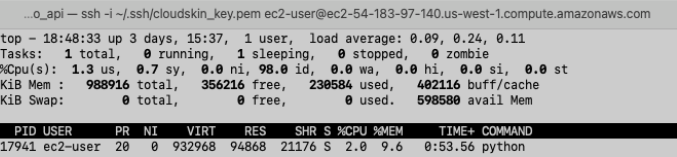
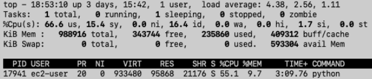
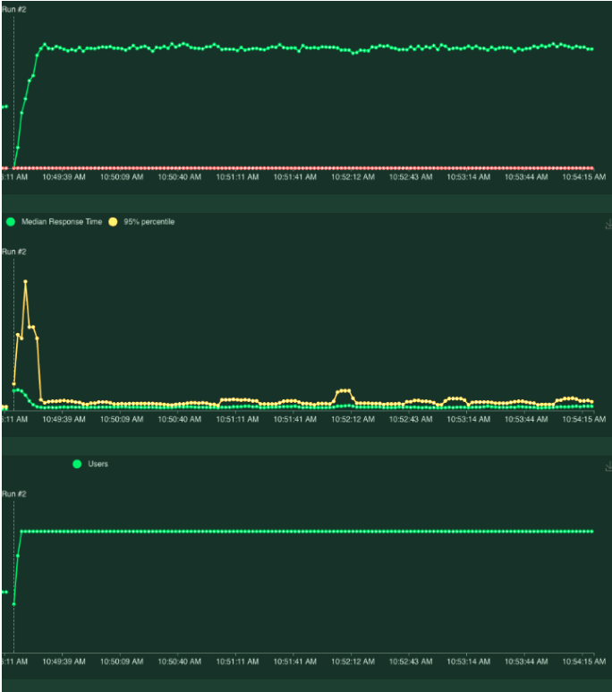
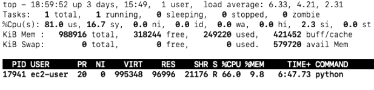
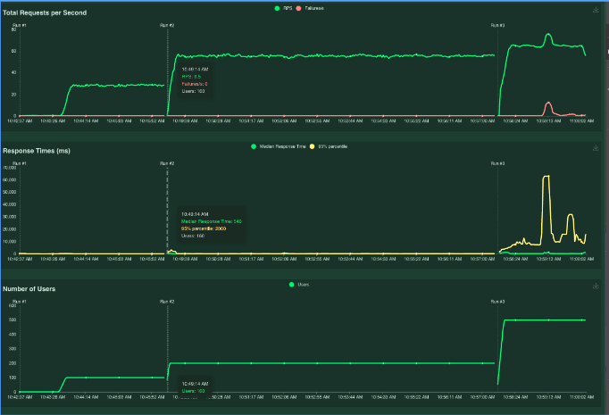
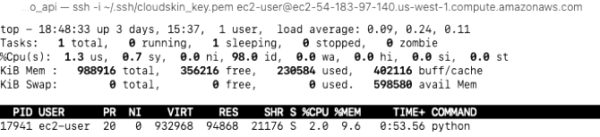
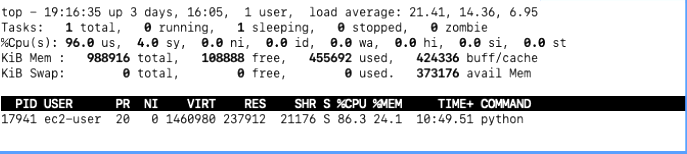
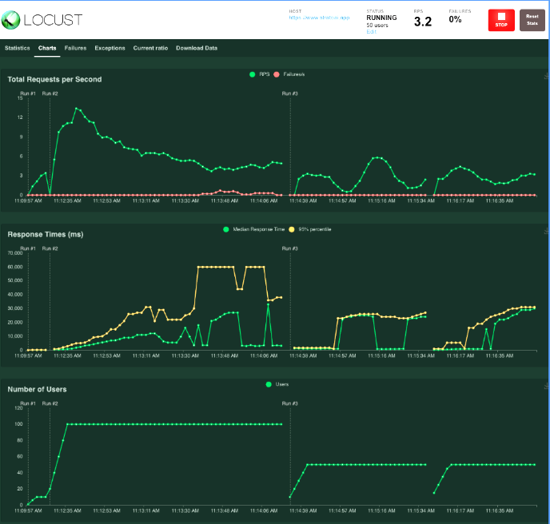
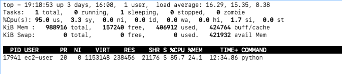

Test 1 : self.client.get('/api/v1/ec2/'
A: No load

B: Total user 200 simultaneous user for read

Response time 3000 ms

C: Total user 500 simultaneous user

Test 2 : self.client.post('/api/v1/ec2/'
A: No load

B: Total user 200 simultaneous user for write

50 users

25user

From command line

(venv) kannappannatarasan@kanna-mac perf % locust --host=https://www.stratoai.app --locustfile ec2_get.py
[2023-02-21 10:04:57,592] kanna-mac.local/INFO/locust.main: Starting web interface at http://0.0.0.0:8089 (accepting connections from all network interfaces)
[2023-02-21 10:04:57,597] kanna-mac.local/INFO/locust.main: Starting Locust 2.14.2
[2023-02-21 10:05:17,191] kanna-mac.local/INFO/locust.runners: Ramping to 1 users at a rate of 1.00 per second
[2023-02-21 10:05:17,199] kanna-mac.local/CRITICAL/locust.runners: Unhandled exception in greenlet: <Greenlet at 0x104c202c0: <lambda>>
[2023-02-21 10:12:44,471] kanna-mac.local/INFO/locust.main: Shutting down (exit code 2)
Type     Name                                                                          # reqs      # fails |    Avg     Min     Max    Med |   req/s  failures/s
--------|----------------------------------------------------------------------------|-------|-------------|-------|-------|-------|-------|--------|-----------
--------|----------------------------------------------------------------------------|-------|-------------|-------|-------|-------|-------|--------|-----------
         Aggregated                                                                         0     0(0.00%) |      0       0       0      0 |    0.00        0.00

Response time percentiles (approximated)
Type     Name                                                                                  50%    66%    75%    80%    90%    95%    98%    99%  99.9% 99.99%   100% # reqs
--------|--------------------------------------------------------------------------------|--------|------|------|------|------|------|------|------|------|------|------|------
--------|--------------------------------------------------------------------------------|--------|------|------|------|------|------|------|------|------|------|------|------

(venv) kannappannatarasan@kanna-mac perf % 
(venv) kannappannatarasan@kanna-mac perf % 
(venv) kannappannatarasan@kanna-mac perf % 
(venv) kannappannatarasan@kanna-mac perf % locust --host=https://www.stratoai.app --locustfile ec2_get.py
[2023-02-21 10:12:47,058] kanna-mac.local/INFO/locust.main: Starting web interface at http://0.0.0.0:8089 (accepting connections from all network interfaces)
[2023-02-21 10:12:47,063] kanna-mac.local/INFO/locust.main: Starting Locust 2.14.2
[2023-02-21 10:13:19,201] kanna-mac.local/INFO/locust.runners: Ramping to 1 users at a rate of 1.00 per second
[2023-02-21 10:16:02,766] kanna-mac.local/INFO/locust.main: Shutting down (exit code 2)
Type     Name                                                                          # reqs      # fails |    Avg     Min     Max    Med |   req/s  failures/s
--------|----------------------------------------------------------------------------|-------|-------------|-------|-------|-------|-------|--------|-----------
--------|----------------------------------------------------------------------------|-------|-------------|-------|-------|-------|-------|--------|-----------
         Aggregated                                                                         0     0(0.00%) |      0       0       0      0 |    0.00        0.00

Response time percentiles (approximated)
Type     Name                                                                                  50%    66%    75%    80%    90%    95%    98%    99%  99.9% 99.99%   100% # reqs
--------|--------------------------------------------------------------------------------|--------|------|------|------|------|------|------|------|------|------|------|------
--------|--------------------------------------------------------------------------------|--------|------|------|------|------|------|------|------|------|------|------|------

(venv) kannappannatarasan@kanna-mac perf % locust --host=https://www.stratoai.app --locustfile ec2_get.py
[2023-02-21 10:16:04,539] kanna-mac.local/INFO/locust.main: Starting web interface at http://0.0.0.0:8089 (accepting connections from all network interfaces)
[2023-02-21 10:16:04,544] kanna-mac.local/INFO/locust.main: Starting Locust 2.14.2
[2023-02-21 10:16:13,832] kanna-mac.local/INFO/locust.runners: Ramping to 1 users at a rate of 1.00 per second
[2023-02-21 10:17:22,164] kanna-mac.local/INFO/locust.main: Shutting down (exit code 2)
Type     Name                                                                          # reqs      # fails |    Avg     Min     Max    Med |   req/s  failures/s
--------|----------------------------------------------------------------------------|-------|-------------|-------|-------|-------|-------|--------|-----------
--------|----------------------------------------------------------------------------|-------|-------------|-------|-------|-------|-------|--------|-----------
         Aggregated                                                                         0     0(0.00%) |      0       0       0      0 |    0.00        0.00

Response time percentiles (approximated)
Type     Name                                                                                  50%    66%    75%    80%    90%    95%    98%    99%  99.9% 99.99%   100% # reqs
--------|--------------------------------------------------------------------------------|--------|------|------|------|------|------|------|------|------|------|------|------
--------|--------------------------------------------------------------------------------|--------|------|------|------|------|------|------|------|------|------|------|------

(venv) kannappannatarasan@kanna-mac perf % locust --host=https://www.stratoai.app --locustfile ec2_get.py
[2023-02-21 10:17:23,658] kanna-mac.local/INFO/locust.main: Starting web interface at http://0.0.0.0:8089 (accepting connections from all network interfaces)
[2023-02-21 10:17:23,663] kanna-mac.local/INFO/locust.main: Starting Locust 2.14.2
[2023-02-21 10:17:28,474] kanna-mac.local/INFO/locust.runners: Ramping to 1 users at a rate of 1.00 per second
[2023-02-21 10:17:28,477] kanna-mac.local/INFO/locust.runners: All users spawned: {"ApiUser": 1} (1 total users)
[2023-02-21 10:17:34,119] kanna-mac.local/INFO/locust.runners: Ramping to 1 users at a rate of 1.00 per second
[2023-02-21 10:17:34,119] kanna-mac.local/INFO/locust.runners: All users spawned: {"ApiUser": 1} (1 total users)
KeyboardInterrupt
2023-02-21T18:23:55Z
[2023-02-21 10:23:55,424] kanna-mac.local/INFO/locust.main: Shutting down (exit code 0)
Type     Name                                                                          # reqs      # fails |    Avg     Min     Max    Med |   req/s  failures/s
--------|----------------------------------------------------------------------------|-------|-------------|-------|-------|-------|-------|--------|-----------
GET      /api/v1/ec2/                                                                      11     0(0.00%) |     66      32     373     35 |    0.30        0.00
--------|----------------------------------------------------------------------------|-------|-------------|-------|-------|-------|-------|--------|-----------
         Aggregated                                                                        11     0(0.00%) |     66      32     373     35 |    0.30        0.00

Response time percentiles (approximated)
Type     Name                                                                                  50%    66%    75%    80%    90%    95%    98%    99%  99.9% 99.99%   100% # reqs
--------|--------------------------------------------------------------------------------|--------|------|------|------|------|------|------|------|------|------|------|------
GET      /api/v1/ec2/                                                                           35     36     38     38     40    370    370    370    370    370    370     11
--------|--------------------------------------------------------------------------------|--------|------|------|------|------|------|------|------|------|------|------|------
         Aggregated                                                                             35     36     38     38     40    370    370    370    370    370    370     11

(venv) kannappannatarasan@kanna-mac perf % locust --host=http://localhost:8000 --locustfile ec2_get.py
[2023-02-21 10:24:07,799] kanna-mac.local/INFO/locust.main: Starting web interface at http://0.0.0.0:8089 (accepting connections from all network interfaces)
[2023-02-21 10:24:07,804] kanna-mac.local/INFO/locust.main: Starting Locust 2.14.2
[2023-02-21 10:24:17,164] kanna-mac.local/INFO/locust.runners: Ramping to 1 users at a rate of 1.00 per second
[2023-02-21 10:24:17,165] kanna-mac.local/INFO/locust.runners: All users spawned: {"ApiUser": 1} (1 total users)
[2023-02-21 10:29:50,474] kanna-mac.local/INFO/locust.runners: Ramping to 1000 users at a rate of 100.00 per second
[2023-02-21 10:29:59,506] kanna-mac.local/INFO/locust.runners: All users spawned: {"ApiUser": 1000} (1000 total users)
[2023-02-21 10:30:37,342] kanna-mac.local/INFO/locust.runners: Ramping to 1000 users at a rate of 10.00 per second
[2023-02-21 10:31:11,554] kanna-mac.local/INFO/locust.runners: Ramping to 1000 users at a rate of 50.00 per second
[2023-02-21 10:31:30,604] kanna-mac.local/INFO/locust.runners: All users spawned: {"ApiUser": 1000} (1000 total users)
KeyboardInterrupt
2023-02-21T18:41:20Z
[2023-02-21 10:41:20,595] kanna-mac.local/INFO/locust.main: Shutting down (exit code 1)
Type     Name                                                                          # reqs      # fails |    Avg     Min     Max    Med |   req/s  failures/s
--------|----------------------------------------------------------------------------|-------|-------------|-------|-------|-------|-------|--------|-----------
GET      /api/v1/ec2/                                                                    3466 1021(29.46%) |   4750       6   25958    140 |   48.13       14.18
--------|----------------------------------------------------------------------------|-------|-------------|-------|-------|-------|-------|--------|-----------
         Aggregated                                                                      3466 1021(29.46%) |   4750       6   25958    140 |   48.13       14.18

Response time percentiles (approximated)
Type     Name                                                                                  50%    66%    75%    80%    90%    95%    98%    99%  99.9% 99.99%   100% # reqs
--------|--------------------------------------------------------------------------------|--------|------|------|------|------|------|------|------|------|------|------|------
GET      /api/v1/ec2/                                                                          140    300  13000  14000  15000  16000  26000  26000  26000  26000  26000   3466
--------|--------------------------------------------------------------------------------|--------|------|------|------|------|------|------|------|------|------|------|------
         Aggregated                                                                            140    300  13000  14000  15000  16000  26000  26000  26000  26000  26000   3466

Error report
# occurrences      Error                                                                                               
------------------|---------------------------------------------------------------------------------------------------------------------------------------------
179                GET /api/v1/ec2/: ConnectionResetError(54, 'Connection reset by peer')                              
712                GET /api/v1/ec2/: HTTPError('500 Server Error: Internal Server Error for url: /api/v1/ec2/')        
130                GET /api/v1/ec2/: TimeoutError(60, 'Operation timed out')                                           
------------------|---------------------------------------------------------------------------------------------------------------------------------------------

(venv) kannappannatarasan@kanna-mac perf % locust --host=https://www.stratoai.app --locustfile ec2_get.py
[2023-02-21 10:42:25,993] kanna-mac.local/INFO/locust.main: Starting web interface at http://0.0.0.0:8089 (accepting connections from all network interfaces)
[2023-02-21 10:42:25,998] kanna-mac.local/INFO/locust.main: Starting Locust 2.14.2
[2023-02-21 10:42:34,909] kanna-mac.local/INFO/locust.runners: Ramping to 1 users at a rate of 1.00 per second
[2023-02-21 10:42:34,911] kanna-mac.local/INFO/locust.runners: All users spawned: {"ApiUser": 1} (1 total users)
[2023-02-21 10:43:35,791] kanna-mac.local/INFO/locust.runners: Ramping to 100 users at a rate of 10.00 per second
[2023-02-21 10:43:44,820] kanna-mac.local/INFO/locust.runners: All users spawned: {"ApiUser": 100} (100 total users)
[2023-02-21 10:49:10,729] kanna-mac.local/INFO/locust.runners: Ramping to 200 users at a rate of 40.00 per second
[2023-02-21 10:49:14,750] kanna-mac.local/INFO/locust.runners: All users spawned: {"ApiUser": 200} (200 total users)
[2023-02-21 10:57:57,113] kanna-mac.local/INFO/locust.runners: Ramping to 500 users at a rate of 50.00 per second
[2023-02-21 10:58:06,146] kanna-mac.local/INFO/locust.runners: All users spawned: {"ApiUser": 500} (500 total users)
KeyboardInterrupt
2023-02-21T19:06:55Z
[2023-02-21 11:06:55,103] kanna-mac.local/INFO/locust.main: Shutting down (exit code 1)
Type     Name                                                                          # reqs      # fails |    Avg     Min     Max    Med |   req/s  failures/s
--------|----------------------------------------------------------------------------|-------|-------------|-------|-------|-------|-------|--------|-----------
GET      /api/v1/ec2/                                                                    9748   247(2.53%) |   3554      31   91489    340 |   63.74        1.61
--------|----------------------------------------------------------------------------|-------|-------------|-------|-------|-------|-------|--------|-----------
         Aggregated                                                                      9748   247(2.53%) |   3554      31   91489    340 |   63.74        1.61

Response time percentiles (approximated)
Type     Name                                                                                  50%    66%    75%    80%    90%    95%    98%    99%  99.9% 99.99%   100% # reqs
--------|--------------------------------------------------------------------------------|--------|------|------|------|------|------|------|------|------|------|------|------
GET      /api/v1/ec2/                                                                          340   1300   1600   3000   6100  16000  60000  61000  68000  91000  91000   9748
--------|--------------------------------------------------------------------------------|--------|------|------|------|------|------|------|------|------|------|------|------
         Aggregated                                                                            340   1300   1600   3000   6100  16000  60000  61000  68000  91000  91000   9748

Error report
# occurrences      Error                                                                                               
------------------|---------------------------------------------------------------------------------------------------------------------------------------------
14                 GET /api/v1/ec2/: HTTPError('502 Server Error: Bad Gateway for url: /api/v1/ec2/')                  
233                GET /api/v1/ec2/: HTTPError('504 Server Error: Gateway Time-out for url: /api/v1/ec2/')             
------------------|---------------------------------------------------------------------------------------------------------------------------------------------

(venv) kannappannatarasan@kanna-mac perf % locust --host=https://www.stratoai.app --locustfile ec2_post.py
[2023-02-21 11:07:05,574] kanna-mac.local/INFO/locust.main: Starting web interface at http://0.0.0.0:8089 (accepting connections from all network interfaces)
[2023-02-21 11:07:05,578] kanna-mac.local/INFO/locust.main: Starting Locust 2.14.2
[2023-02-21 11:07:20,159] kanna-mac.local/INFO/locust.runners: Ramping to 10 users at a rate of 1.00 per second
[2023-02-21 11:07:29,189] kanna-mac.local/INFO/locust.runners: All users spawned: {"QuickstartUser": 10} (10 total users)
KeyboardInterrupt
2023-02-21T19:09:44Z
[2023-02-21 11:09:44,639] kanna-mac.local/INFO/locust.main: Shutting down (exit code 1)
Type     Name                                                                          # reqs      # fails |    Avg     Min     Max    Med |   req/s  failures/s
--------|----------------------------------------------------------------------------|-------|-------------|-------|-------|-------|-------|--------|-----------
GET      /api/v1/ec2/                                                                      87     0(0.00%) |     49      30     330     35 |    3.15        0.00
POST     /ec2/                                                                             37  37(100.00%) |     56      15     254     22 |    1.34        1.34
--------|----------------------------------------------------------------------------|-------|-------------|-------|-------|-------|-------|--------|-----------
         Aggregated                                                                       124   37(29.84%) |     51      15     330     34 |    4.49        1.34

Response time percentiles (approximated)
Type     Name                                                                                  50%    66%    75%    80%    90%    95%    98%    99%  99.9% 99.99%   100% # reqs
--------|--------------------------------------------------------------------------------|--------|------|------|------|------|------|------|------|------|------|------|------
GET      /api/v1/ec2/                                                                           35     38     40     42     62    110    280    330    330    330    330     87
POST     /ec2/                                                                                  22     26     47     95    240    240    250    250    250    250    250     37
--------|--------------------------------------------------------------------------------|--------|------|------|------|------|------|------|------|------|------|------|------
         Aggregated                                                                             34     37     41     45    100    240    280    280    330    330    330    124

Error report
# occurrences      Error                                                                                               
------------------|---------------------------------------------------------------------------------------------------------------------------------------------
37                 POST /ec2/: HTTPError('405 Client Error: Not Allowed for url: /ec2/')                               
------------------|---------------------------------------------------------------------------------------------------------------------------------------------

(venv) kannappannatarasan@kanna-mac perf % locust --host=https://www.stratoai.app --locustfile ec2_post.py
[2023-02-21 11:09:46,996] kanna-mac.local/INFO/locust.main: Starting web interface at http://0.0.0.0:8089 (accepting connections from all network interfaces)
[2023-02-21 11:09:47,001] kanna-mac.local/INFO/locust.main: Starting Locust 2.14.2
[2023-02-21 11:09:56,205] kanna-mac.local/INFO/locust.runners: Ramping to 10 users at a rate of 1.00 per second
[2023-02-21 11:10:05,230] kanna-mac.local/INFO/locust.runners: All users spawned: {"QuickstartUser": 10} (10 total users)
[2023-02-21 11:12:25,688] kanna-mac.local/INFO/locust.runners: Ramping to 100 users at a rate of 10.00 per second
[2023-02-21 11:12:34,708] kanna-mac.local/INFO/locust.runners: All users spawned: {"QuickstartUser": 100} (100 total users)
[2023-02-21 11:14:32,051] kanna-mac.local/INFO/locust.runners: Ramping to 50 users at a rate of 5.00 per second
[2023-02-21 11:14:41,078] kanna-mac.local/INFO/locust.runners: All users spawned: {"QuickstartUser": 50} (50 total users)
[2023-02-21 11:16:02,906] kanna-mac.local/INFO/locust.runners: Ramping to 50 users at a rate of 5.00 per second
[2023-02-21 11:16:11,937] kanna-mac.local/INFO/locust.runners: All users spawned: {"QuickstartUser": 50} (50 total users)
[2023-02-21 11:17:37,562] kanna-mac.local/INFO/locust.runners: Ramping to 25 users at a rate of 5.00 per second
[2023-02-21 11:17:41,578] kanna-mac.local/INFO/locust.runners: All users spawned: {"QuickstartUser": 25} (25 total users)
[2023-02-21 11:19:44,832] kanna-mac.local/INFO/locust.runners: Ramping to 10 users at a rate of 5.00 per second
[2023-02-21 11:19:45,837] kanna-mac.local/INFO/locust.runners: All users spawned: {"QuickstartUser": 10} (10 total users)
[2023-02-21 12:17:24,225] kanna-mac.local/INFO/locust.runners: Ramping to 100 users at a rate of 10.00 per second
[2023-02-21 12:17:33,242] kanna-mac.local/INFO/locust.runners: All users spawned: {"QuickstartUser": 100} (100 total users)
[2023-02-21 12:21:44,288] kanna-mac.local/INFO/locust.runners: Ramping to 10 users at a rate of 1.00 per second
[2023-02-21 12:21:53,316] kanna-mac.local/INFO/locust.runners: All users spawned: {"QuickstartUser": 10} (10 total users)
[2023-02-21 12:22:45,205] kanna-mac.local/INFO/locust.runners: Ramping to 50 users at a rate of 5.00 per second
[2023-02-21 12:22:54,230] kanna-mac.local/INFO/locust.runners: All users spawned: {"QuickstartUser": 50} (50 total users)
[2023-02-21 12:24:45,585] kanna-mac.local/INFO/locust.runners: Ramping to 100 users at a rate of 10.00 per second
[2023-02-21 12:24:54,606] kanna-mac.local/INFO/locust.runners: All users spawned: {"QuickstartUser": 100} (100 total users)
[2023-02-21 12:37:27,801] kanna-mac.local/INFO/locust.runners: Ramping to 50 users at a rate of 10.00 per second
[2023-02-21 12:37:31,816] kanna-mac.local/INFO/locust.runners: All users spawned: {"QuickstartUser": 50} (50 total users)
[2023-02-21 12:42:54,386] kanna-mac.local/INFO/locust.runners: Ramping to 50 users at a rate of 10.00 per second
[2023-02-21 12:42:58,430] kanna-mac.local/INFO/locust.runners: All users spawned: {"QuickstartUser": 50} (50 total users)
[2023-02-21 12:44:00,079] kanna-mac.local/INFO/locust.runners: Ramping to 100 users at a rate of 10.00 per second
[2023-02-21 12:44:09,104] kanna-mac.local/INFO/locust.runners: All users spawned: {"QuickstartUser": 100} (100 total users)
KeyboardInterrupt
2023-02-23T05:55:48Z
[2023-02-22 21:55:48,280] kanna-mac.local/INFO/locust.main: Shutting down (exit code 1)
Type     Name                                                                          # reqs      # fails |    Avg     Min     Max    Med |   req/s  failures/s
--------|----------------------------------------------------------------------------|-------|-------------|-------|-------|-------|-------|--------|-----------
GET      /api/v1/ec2/                                                                       2   2(100.00%) |   3116    2953    3278   3000 |    0.04        0.04
POST     /api/v1/ec2/                                                                      98     2(2.04%) |   9612    1865   38796   4600 |    2.09        0.04
--------|----------------------------------------------------------------------------|-------|-------------|-------|-------|-------|-------|--------|-----------
         Aggregated                                                                       100     4(4.00%) |   9482    1865   38796   4500 |    2.14        0.09

Response time percentiles (approximated)
Type     Name                                                                                  50%    66%    75%    80%    90%    95%    98%    99%  99.9% 99.99%   100% # reqs
--------|--------------------------------------------------------------------------------|--------|------|------|------|------|------|------|------|------|------|------|------
GET      /api/v1/ec2/                                                                         3300   3300   3300   3300   3300   3300   3300   3300   3300   3300   3300      2
POST     /api/v1/ec2/                                                                         4700   7200  12000  17000  32000  36000  37000  39000  39000  39000  39000     98
--------|--------------------------------------------------------------------------------|--------|------|------|------|------|------|------|------|------|------|------|------
         Aggregated                                                                           4600   7200  12000  17000  32000  36000  37000  39000  39000  39000  39000    100

Error report
# occurrences      Error                                                                                               
------------------|---------------------------------------------------------------------------------------------------------------------------------------------
2                  POST /api/v1/ec2/: HTTPError('502 Server Error: Bad Gateway for url: /api/v1/ec2/')                 
2                  GET /api/v1/ec2/: HTTPError('500 Server Error: Internal Server Error for url: /api/v1/ec2/')        
------------------|---------------------------------------------------------------------------------------------------------------------------------------------

