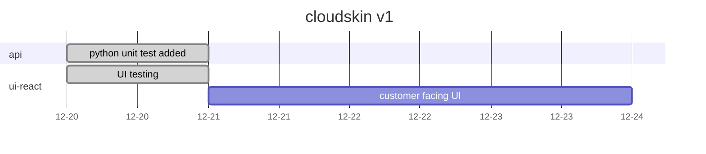

```mermaid
gantt
    title cloudskin v1    
    dateFormat  YYYY-MM-DD
    axisFormat %m-%d
    

    
section api                       
    python unit test added   :done, a1, 2022-12-20, 2022-12-21

section ui-react
    UI testing              :done, ui1, 2022-12-20, 2022-12-21
    customer facing UI      :after ui1, 2022-12-21  , 3d
    
    %% https://marmelab.com/blog/2016/04/19/e2e-testing-with-node-and-es6.html
```

[To build Gantt chart](https://mermaid.js.org/syntax/gantt.html)
