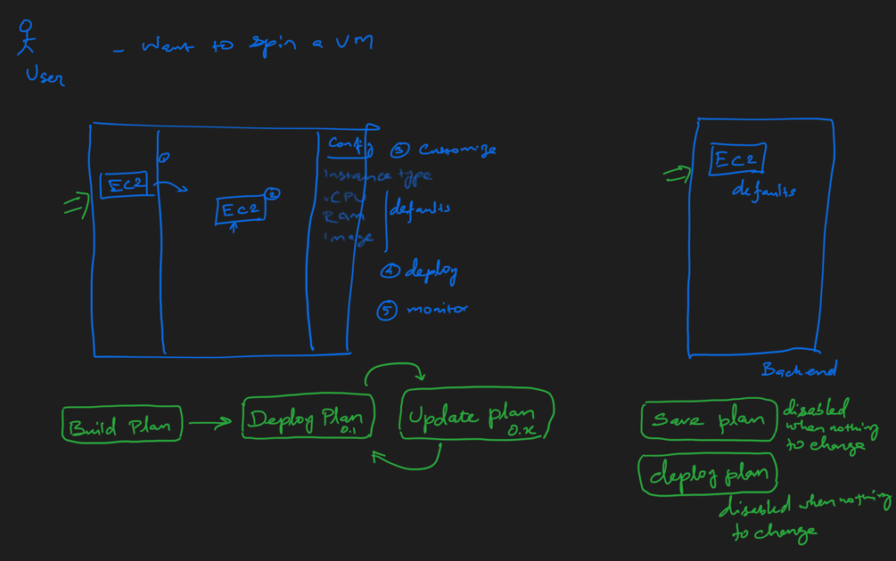

Release 1 
===========
    Objective : Customer deploys a PG in AWS very comfortably and manages

#### website story board  ** COMPLETED **
	- Landing page
		[logo, about, contact]
		- [What we can offer]: 
			- No code cloud deployment
			- One click deployment
			- Best practices applied [you can focus on your business]
		
	- Sign up (register) , Login
	- Logged In 
		- Dashboard
			- Create a Plan 
				- Save plan
				- Deploy plan

			- List Plan
				- Show status of plan
				- Edit plan
				- re-deploy
### ui to back end flow

- Plan :
  - Composed of
    - EC2 : 
      - Front end image has its equivalent backend class
      - Once dragged and dropped , an object is created in backend

##### References
1. [Authentication tutorial](https://medium.com/@sushil-kamble/django-rest-framework-react-authentication-workflow-2022-part-1-a21f22b3f358)
2. [Enable swagger documentation for django restframework ](https://www.jasonmars.org/2020/04/22/add-swagger-to-django-rest-api-quickly-4-mins-without-hiccups/)
3. [Implement Authorization in DRF Django Rest Framework](https://testdriven.io/blog/drf-permissions/)
4. [Core params to create postgres](https://pgtune.leopard.in.ua/)
5. [How to prepare IAM user](https://src-bin.com/an-aws-account-just-for-getting-into-other-aws-accounts/)
6. [skin for cloud from GCP](https://cloud.google.com/blog/topics/developers-practitioners/introducing-google-cloud-architecture-diagramming-tool)
7. [React Router and Link](https://www.freecodecamp.org/news/react-router-tutorial/)

Business
1. [Startup checklist ](https://artistic-aura-eff.notion.site/The-Startup-Checklist-89ae7a59975b4064b4a9fff146f2ce4c)
#### User flow

User --> login --> www.cs.io -->
	- create new plan
		- save
		- deploy
	[ PG is deployed up and running in his AWS  Account ] 

#### Functional 

	- PG (drag n drop)
	- Choose OS (suggested Linux with version ) Amazon linux 
	- Option to select EC2 VM type ( RAM , vCPU)
		- Choose disk 
			- SSD is default : user chooses the size  ( all other configs are default)

	- Base configs
		- Number of connections
		- Backup requirements collected ( to be taken care)
			- Scheduled back up 
			- Back up stored in s3
			- (Back up validation )

		- DB version (Defaulted)
	- Save ( a json cloud agnostic, cs-json )
	
	- Deploy
		- cs-json 
			-> Transformer (A knowledge base has to be applied)-> aws json [ used for deploy, monitor and manage]
			- Create EC2
			- Configure SG
			- Install PG   (Single instance or cluster)
			- Configure PG
			[-> Transformer -> azure json]
		- should deploy above configs irrespective cloud ( AWS, GCP, Azure)
[	- Monitor
	- Manage	] Enhancements

APP [VM]
	{ 
		- Backend
			- Installation/deployment script
				- python env 
				- wsgi 
				- DB config, Security Group config
			- Operational script
		- Front end
			- Installation script
			- Operational script
			
	}

	github
		- Installation script
		- Operational script 

------------------------------------------------------------------

### Tasks
#### UI
- Build basic flow using bootstrap
- Build React flow
  - signup
  - login
  - dashboard 
    - List of plan 
    - plan (enhance existing one)
- Enahance edit plan page
  - Drag n Drop Icon : Add properties page right side
  - Properties
    - OS
      - version OS
    - hardware (aws)
      - instance type
      - hard disk
      - AMI
    - DB
      - flavor (eg: pg) 
      - version
      - backup
  - Add Deploy button

PG
	- save plan
	- update plan
	- deploy

#### API

##### create and maintain plan

- post: v1/plan/
  -`{ os:'linux', 
         hardware:{ instance_type:,storage:'ssd',ami:'myami'},
         db: {flavor:'pg',version:'15',backup:'needed'}
       }`
  - creates the plan
- put: v1/plan/{plan_id}
  - updates plan
- delete: v1/plan/
  - deletes the plan
- get: v1/plan/{plan_id}
  - specic plan
- get : v1/plan/ 
    - list of all plans

##### deploy and maintain
- post: v1/plan/{plan_id}/deploy/
  - deploys the plan
    - new deployment : if there is no deployment for this plan
    - re-deploy : if there is a deployment for this plan

##### Deploy cycle

1. Create plan
2. Add components
3. Configure components
4. Click "Deploy Plan" -> Deploy triggered in backend  [Indiator for deployment]
   - 
5. After success full deployment front end updated
6. Monitoring get triggered for components
- "Deploy Plan " : button disabled when there is no deployment

Monitoring : 
- Gray empty circle not deployed 
- Orange : deploying (opitonal)
- Green : running
- red : Have some issues ( eg: SG not configured )
    

#### Securing Keys

https://arctype.com/blog/transparent-data-encryption/
https://towardsaws.com/hack-aws-ec2-catch-aws-account-15517ffe5450
https://www.lepide.com/blog/the-15-most-common-types-of-cyber-attacks/
https://systemweakness.com/how-to-get-started-hacking-django-applications-f407564df9c7

#### Start up support

https://cloud.google.com/startup
https://aws.amazon.com/activate/